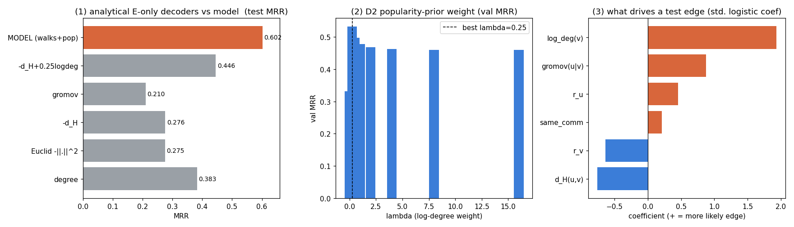
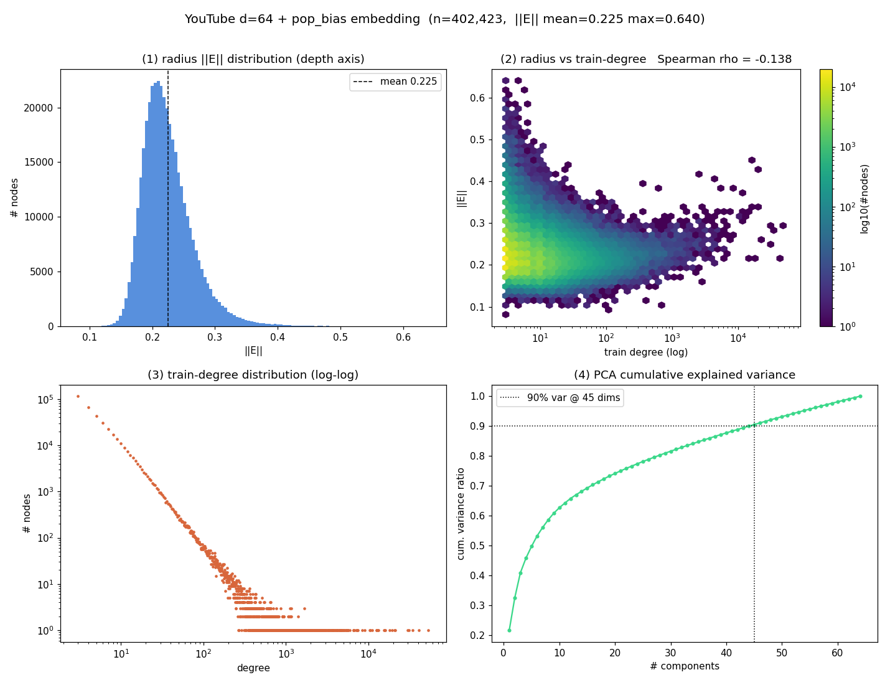
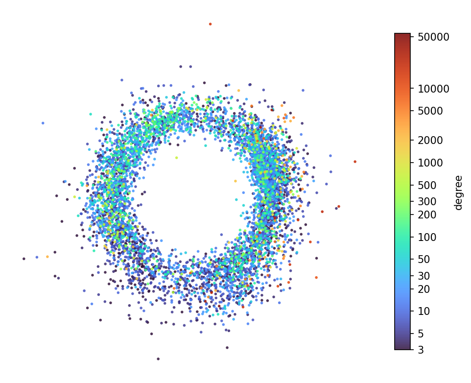

# YouTube embedding analysis — `geo_temp·(−d_H) + pop_bias`, d=64, K=5

Analytical reconstruction and organizational study of the saved Poincaré-ball embedding from the
**popularity-channel** run on YouTube (TGB-Seq).

| | |
|---|---|
| Embedding | `logs/embeddings/YouTube_seed42_demb64_ep15.npy` — 402,423 × 64, Poincaré ball (c=1) |
| Head | `s(u,v) = geo_temp·(−d_H(P_u, P_v)) + pop_bias[v]` |
| Model test MRR | **0.6016** (val 0.6943, peak ep15, `--use-pop-bias`, lr 1e-3, seed 42) |
| Eval protocol | exact TGB-Seq MRR (`rank = 0.5·((neg>pos)+(neg≥pos))+1`), 232,865 test edges × 100 shipped negatives |
| Reproduce | `python scripts/full_embedding_analysis.py logs/embeddings/YouTube_seed42_demb64_ep15.npy` |

## The constraint

Only **`E`** was exported. The model scores with the *walk-pooled* centroid `P_u` (Tempest samples
K cutoff-`t` walks for `u`, an MLP pools the tokens, then gyro-midpoint) plus a learned per-node
`pop_bias[v]` table — neither the pooler, `geo_temp`, `pop_bias`, nor the walk sampler was saved. So
this study measures **how much of the ranking the static geometry of `E` explains**, and **what
`E`'s organization is** — not a byte-for-byte reproduction. Every decoder below is closed-form on
`E` with no training and no walks; the popularity-prior weight λ is fit on **val only**.

---

## Part 1 — Can the ranking be reconstructed analytically? Partially, and popularity beats geometry.

| decoder (analytical, on `E`) | test MRR | % of model |
|---|---:|---:|
| Gromov product `(u\|v)_o = ½(r_u+r_v−d_H)` | 0.2103 | 35% |
| Euclidean `−‖E_u−E_v‖²` | 0.2753 | 46% |
| hyperbolic `−d_H(E_u, E_v)` | 0.2761 | 46% |
| degree-only `log deg(v)` | 0.3827 | 64% |
| **`−d_H + 0.25·log deg(v)`** (val-fit λ=0.25) | **0.4457** | **74%** |
| **MODEL (walks + learned pop_bias)** | **0.6016** | 100% |

1. **Pure geometry is a weak ranker.** `−d_H` alone = 0.276 (46%). `E`'s raw pairwise distances carry
   less than half the model's ranking power.
2. **Popularity alone beats geometry.** `log deg(v)` = 0.383 > `−d_H` = 0.276. On YouTube, "guess the
   popular node" is a stronger *static* signal than "guess the geometrically close node."
3. **Hyperbolic ≈ Euclidean, and Gromov is worst.** `−d_H` (0.276) ≈ Euclidean (0.275): the curvature
   buys nothing on this thin-shell embedding. The Gromov score (0.210) is the *weakest* decoder — an
   independent confirmation that, as a ranker on this data, it is actively worse than plain distance.
4. **Static `E` + a light popularity prior recovers 74%** (0.4457 at λ=0.25). The remaining **26% gap
   to 0.6016 is the walk-pooling substrate + the learned per-node `pop_bias`**, which `E` cannot hold.

---

## Part 2 — Organization: a near-tree metric, expressed as angular communities, not a radial hierarchy.

- **δ-hyperbolicity** (Gromov 4-point on 1,500 sampled nodes): δ/diam **0.115** worst-case, **0.019**
  mean. The cloud embeds close to a **tree metric** — it *is* hyperbolically organized.
- **But the tree is not the radius.** Spearman(‖E‖, degree) = **−0.14** (weak): depth does not encode
  popularity, because `pop_bias` offloaded that role. Radius is a near-constant thin shell (‖E‖ mean
  0.225, p10–p90 = 0.18–0.28), and the embedding uses **45/64 dims for 90% variance** — genuinely
  high-dimensional, not collapsed.
- **The structure is angular-community.** Spherical k-means (K=100) on unit directions:
  **P(same community | test edge) = 0.142 vs 0.011 for negatives — a 13× lift.** Real links live
  *within* angular communities; that is where the tree-likeness surfaces (directional clusters on the
  shell), not as a radial ancestor hierarchy.

The disk plot makes it visible: a **hollow ring** (the tight radius shell → empty center), with
high-degree hubs (orange/red) scattered around the rim rather than pooled at the center — the exact
opposite of the textbook "hubs at the origin" hierarchy, and a direct consequence of `pop_bias`.

---

## Part 3 — What drives an edge? Popularity first, then geometry, then community.

Standardized logistic regression, test edge vs one sampled negative (80,000 pairs, **81.8% separable**):

| feature | std. coef | reading |
|---|---:|---|
| **log_deg(v)** | **+1.93** | popularity is the dominant driver, by ~2× |
| gromov(u\|v) | +0.87 | shared-branch proximity helps |
| d_H(u,v) | −0.76 | closer ⇒ more likely (same axis as gromov) |
| r_v | −0.64 | candidate being a **hub near origin** helps |
| r_u | +0.46 | deeper source ⇒ more likely |
| same_comm | +0.21 | community adds a real, smaller boost |

---

## Bottom line

- **~74% of the model's ranking is recoverable** from frozen `E` with the one-line closed form
  `−d_H + 0.25·log deg(v)` — and within that, **popularity is the bigger half, geometry the smaller**.
- The last **26% is the walk substrate + learned `pop_bias`**, which the static embedding cannot hold.
- `E`'s organization is a **near-tree metric expressed as angular communities on a thin shell**
  (13× within-community link lift) with a **weak radial axis** — a direct, quantitative consequence
  of `pop_bias` freeing the geometry from having to encode degree.
- Every geometry-only signal (hyperbolic, Euclidean, Gromov) is **beaten by raw popularity** — which
  is why `pop_bias` was the decisive lever, and why the field-standard hyperbolic decoder is the
  distance-plus-per-entity-bias form `−d + b_t` (MuRP / RotH / AttH).

Scripts: `scripts/full_embedding_analysis.py` (Parts 1–3), `scripts/analyze_pop_embedding.py`
(embedding-stats figure), `plots/ball_plot.py` (Poincaré disk), `scripts/hierarchy_rho.py`
(‖E‖–degree Spearman).
